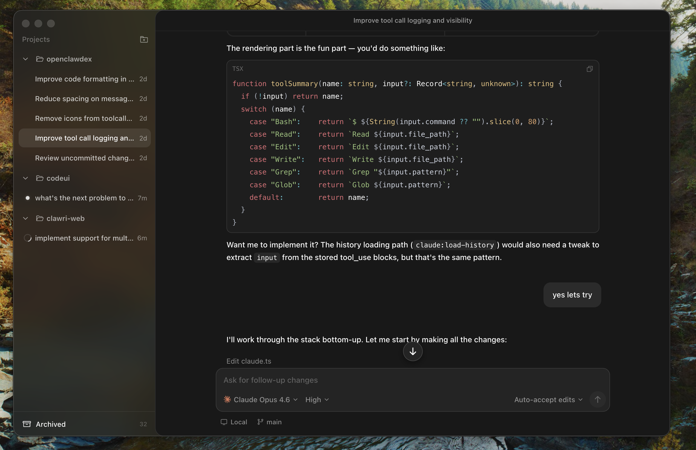

<p align="center">
  
</p>

<h1 align="center">OpenClawdex</h1>

<p align="center">
  The open source AI coding agent orchestrator.
</p>

<p align="center">
  Lightweight desktop UI for orchestrating Claude (and in the future Codex) coding agents through their CLIs, with a native Mac feel. No separate login &mdash; it uses your existing Claude Code auth.
</p>

<p align="center">
  
</p>

## Install

1. Download the latest `.dmg` from the [Releases](https://github.com/alekseyrozh/openclawdex/releases) page
2. Double-click the downloaded `.dmg` and drag the OpenClawdex app into the Applications folder
3. Launch OpenClawdex from the Applications folder or Launchpad

### Prerequisites

OpenClawdex spawns CLI agents as subprocesses, so you need at least one installed and authenticated:

- **Claude Code** &mdash; `npm install -g @anthropic-ai/claude-code` then `claude auth login`

No API keys needed &mdash; the app uses your existing CLI logins.

## Build from source

### Requirements

- Node.js 20+
- [pnpm](https://pnpm.io/) 9+

### Development

```bash
# Install dependencies
pnpm install

# Start the Vite dev server + Electron
pnpm dev:desktop
```

The Electron window loads from `http://localhost:3000`. Hot reload works for the web app.

### Production build

```bash
# Build everything and package the macOS .dmg
pnpm dist
```

Output goes to `apps/desktop/release/`.

## Architecture

pnpm monorepo with three packages:

```
apps/
  web/       React + Vite + Tailwind v4 frontend
  desktop/   Electron shell + CLI agent integration
packages/
  shared/    Zod schemas for IPC messages
```

The Electron main process spawns `claude` (via Agent SDK with `--output-format stream-json`) and `codex` (via `app-server` JSON-RPC) as subprocesses, bridging their output to the React UI over IPC.

## Contributing

1. Fork the repo
2. Create a feature branch (`git checkout -b my-feature`)
3. Make your changes
4. Run `pnpm dev:desktop` and verify everything works
5. Commit and push
6. Open a pull request

## License

[MIT](LICENSE)
